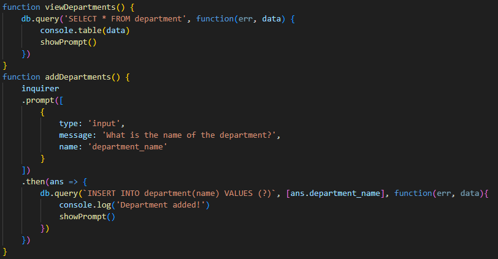

# employee-tracker

## Description

This project was built to create a database with employee information of departments, roles, names. It is a simple tool that allows users to see and add new information.

Video demonstration: https://drive.google.com/file/d/1qYaniNqco6TQBFlk3OTdZHHJOv3_dvQG/view 

## Table of Contents

- [Installation](#installation)
- [Usage](#usage)
- [Technologies Used](#technologies-used)
- [Credits](#credits)

## Installation

1. Install node.js (https://nodejs.org/en)
2. Run 'node server.js'
3. Select from the prompt and the relevant action will be performed

## Usage

These are all the npms or packages needed to run the program. They are imported into server.js

We create an employee database on the sql file and create the three tables: department, role, and employee.

After entering 'node server.js', the user is prompted with a list of actions that can be performed. According to what the user chooses, a function is triggered.

We use db.query to create sql syntax functions. So by selecting all from the table, it displays the data using the npm console.table. We are also able to add to the department table by prompting the user with questions and using db.query to insert into the table.

The same is done for the roles table, but for the department id, we need the names of the current departments to display, which is why we need to use the .map method to get the data.

## Technologies Used
- inquirer npm (https://www.npmjs.com/package/inquirer#prompt)
- node.js (https://nodejs.org/en)
- MySQL (https://www.mysql.com/)

## Credits

Tutor Joem Casusi

BCS Erica and Jerromy

## Note

I only got to accomplish add/display department and add/display role. I will be resubmitting this assignment at a later time.